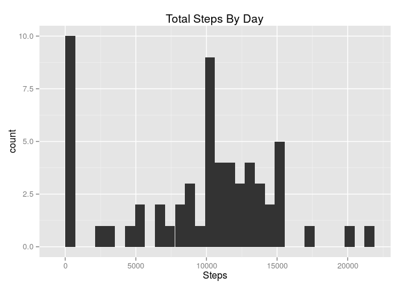

# Reproducible Research: Peer Assessment 1

## Loading and preprocessing the data


```r
library(ggplot2, quietly = TRUE, verbose = FALSE)
library(dplyr, quietly = TRUE, verbose = FALSE)
```

```
## 
## Attaching package: 'dplyr'
## 
## The following object is masked from 'package:stats':
## 
##     filter
## 
## The following objects are masked from 'package:base':
## 
##     intersect, setdiff, setequal, union
```

```r
library(chron, quietly = TRUE, verbose = FALSE)
dsClasses <- c("numeric", "character", "numeric")
ds <- read.csv("activity.csv", header = TRUE, colClasses = dsClasses, na.strings=c("","NA"))
ds$date <- as.Date(ds$date, format="%Y-%m-%d")
```

## Total number of steps taken per day

Below, you can see the histogram of the mean and median of the total number of steps taken per day.


```r
totalStepsByDate = summarise(group_by(ds, date), totalSteps = sum(steps, na.rm = TRUE))
qplot(totalStepsByDate$totalSteps, geom="histogram")
```

```
## stat_bin: binwidth defaulted to range/30. Use 'binwidth = x' to adjust this.
```

 

## Mean total number of steps taken per day?

The mean is 9354.22950819672

The average is 10395

## Average daily activity pattern?

This is a time series plot (i.e. type = "l") of the 5-minute interval (x-axis) and the average number of steps taken, averaged across all days (y-axis)


```r
averageStepsByInterval = summarise(group_by(ds, interval), averageSteps = mean(steps, na.rm = TRUE))
ggplot(averageStepsByInterval, aes(interval, averageSteps)) + geom_line() + xlab("Interval") + ylab("Daily Views")
```

 

The maximum number of steps (5-minute interval, on average across all the days in the dataset) is 835, 206.169811320755
```

## Imputing missing values

Total number of missing values in the dataset is 0


```r
ds$steps[is.na(ds$steps) == TRUE] <- 0
```

Below is a histogram of the total number of steps taken each day and Calculate and report the mean and median total number of steps taken per day.


```r
totalStepsByDate = summarise(group_by(ds, date), totalSteps = sum(steps, na.rm = FALSE))
qplot(totalStepsByDate$totalSteps, geom="histogram")
```

```
## stat_bin: binwidth defaulted to range/30. Use 'binwidth = x' to adjust this.
```

 

The mean is 9354.22950819672

The average is 10395

## Differences in activity patterns between weekdays and weekends


```r
daysOfWeek <- is.weekend(ds$date)
ds$isWeekend <- factor(daysOfWeek, labels = c("Weekday", "Weekend"))
averageStepsByInterval = summarise(group_by(ds, interval, isWeekend), averageSteps = mean(steps, na.rm = TRUE))

g <- ggplot(averageStepsByInterval, aes(interval, averageSteps)) + geom_line() + xlab("Interval") + ylab("Average Steps")
g + facet_grid(isWeekend ~ .)
```

 
